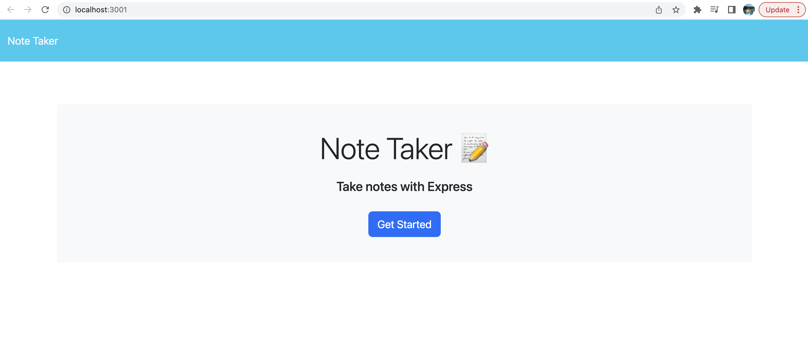
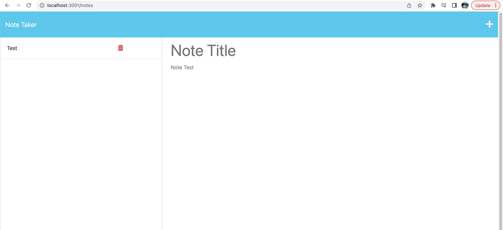
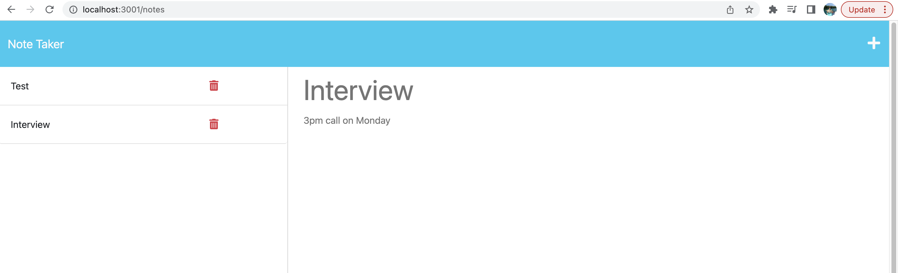

# Note Taker

## Description
This note taker application allows the user to enter a title and description for notes and save them on the webpage. The app is built using a combination of front-end and back-end development. The front-end includes normal javscript, html, and css while the back-end utilizes Express.js to get and post the data. 

## Installation
N/A

## Usage
The webpage has two main pages; the landing page (pictured below) and the notes page. 

On the main page, you will see a blue "Get Started" button. Once you click on this button, you will be taken to a new page. The page is titled "Note Taker" and has saved notes on the left side of the screen and a section to write in the Note Title and Note Text on the right side of the screen.

To enter a new note, simply fill out the "Note Title" and "Note Text" sections on the right side of the webpage. Once you have text in those areas, you will see a save icon pop up on the top right corner of the webpage. If you click on this save icon, your note will be saved and appear on the left side of the screen. 

This application also allows you to click on previous notes and they will reappear on the right side of your screen. Simply click on a note from the left side of the screen and it will appear as shown below. If you would like to add a new note, then click the plus sign on the top right corner of the screen and that note will dissapear and you can add a new one. 

Below is a link to the active heroku website:

https://git.heroku.com/secure-plains-21587.git

## Credits

Class Exercises

## License
Please refer to the license in the repo.